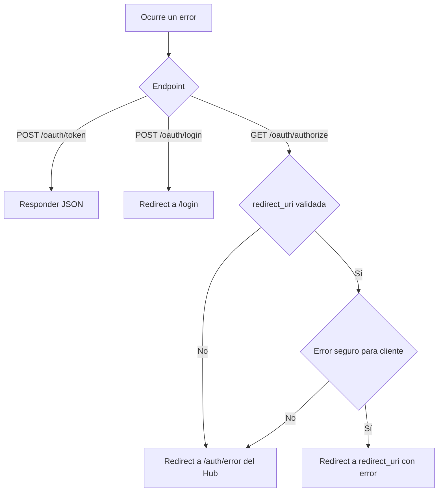

# OAuth Error Handling

## Objetivo
Este documento clasifica los errores del backend según el canal correcto de salida.

La regla central es simple:
- si todavía no existe un callback confiable, el error se queda dentro del Identity Hub
- si `redirect_uri` ya fue validada, algunos errores pueden volver al cliente
- si el endpoint es machine-to-machine, la respuesta debe ser JSON

## Matriz rápida
| Escenario | Endpoint | Canal | Destino |
| --- | --- | --- | --- |
| Login inválido | `POST /oauth/login` | Redirect navegador | UI del Hub en `/login` |
| `client_id` inválido | `GET /oauth/authorize` | Redirect navegador | UI del Hub en `/auth/error` |
| `redirect_uri` inválida | `GET /oauth/authorize` | Redirect navegador | UI del Hub en `/auth/error` |
| Usuario sin acceso a app | `GET /oauth/authorize` | Redirect navegador | Callback cliente validado |
| Error en code exchange | `POST /oauth/token` | JSON | Cliente backend |
| Error en refresh token | `POST /oauth/token` | JSON | Cliente backend |
| Sesión inválida en endpoint protegido | APIs protegidas | JSON | Consumidor actual |

## Principios
| Principio | Motivo |
| --- | --- |
| No redirigir al cliente antes de validar `client_id` y `redirect_uri` | Evita redirects inseguros |
| Mantener `/oauth/token` como JSON | Es un endpoint backend-to-backend |
| Mostrar errores de login en `/login` | La UI del Hub controla el feedback de autenticación |
| Permitir `error=access_denied` al cliente sólo después de validar el callback | El destino ya es confiable |

## 1. Errores de login
Aplica a `POST /oauth/login`.

### Casos típicos
| Caso | Resultado |
| --- | --- |
| Credenciales inválidas | Redirect a `/login?error=invalid_credentials` |
| Usuario deshabilitado | Redirect a `/login?error=user_disabled` |
| Login durante flujo SSO pendiente | Conserva `auth_request_id` en el redirect |

### Forma esperada
| Parámetro | Uso |
| --- | --- |
| `error` | Código de error mostrado por la UI |
| `auth_request_id` | Permite conservar el contexto del authorize pendiente |

Ejemplos:
- `/login?error=invalid_credentials`
- `/login?error=user_disabled&auth_request_id=...`

## 2. Errores tempranos de authorize
Aplica a `GET /oauth/authorize` antes de poder confiar en el callback del cliente.

### Casos típicos
| Caso | Motivo |
| --- | --- |
| `client_id` inexistente | La app no es válida |
| `redirect_uri` no registrada | El callback no es confiable |
| Request OAuth malformado | El backend no puede continuar con seguridad |

### Comportamiento esperado
| Decisión | Resultado |
| --- | --- |
| No redirigir al cliente | Se evita usar una URI no validada |
| Mostrar error en UI propia | Redirect a `IDENTITY_HUB_UI_BASE_URL/auth/error?error=...` |

## 3. Errores seguros que pueden volver al cliente
Aplica a `GET /oauth/authorize` después de validar app y `redirect_uri`.

### Caso actual principal
| Caso | Resultado |
| --- | --- |
| Usuario autenticado sin acceso a la app | Redirect a `redirect_uri?error=access_denied` |

### Reglas
| Regla | Detalle |
| --- | --- |
| Sólo después de validar `redirect_uri` | Antes de eso, el error se queda en el Hub |
| Preservar `state` si existe | El cliente puede correlacionar la respuesta |

## 4. Errores de `/oauth/token`
Aplica a `POST /oauth/token`.

### Casos típicos
| Caso | Ejemplo |
| --- | --- |
| Cliente inválido | `client_id` inexistente o inactivo |
| Secreto inválido | `client_secret` incorrecto |
| Authorization code inválido | Inexistente, expirado o reutilizado |
| Refresh token inválido | Inexistente, expirado o reutilizado |
| Usuario inválido | Eliminado o deshabilitado |
| Acceso revocado | El usuario ya no tiene acceso a la app |

### Canal
| Regla | Resultado |
| --- | --- |
| Nunca usar redirects | Respuesta JSON |
| Mantener semántica HTTP | 4xx cuando el request no puede continuar |

## 5. Errores en endpoints protegidos por sesión
Aplica a endpoints detrás de `SessionGuard`, por ejemplo `/auth/status`.

### Casos típicos
| Caso | Resultado |
| --- | --- |
| Cookie `session_id` ausente | `401` JSON |
| Sesión inexistente en Redis | `401` JSON |
| Usuario eliminado o deshabilitado | `401` JSON |

## Secuencia de decisión
Si el visor no renderiza Mermaid, la secuencia es:
1. Determinar si el endpoint es navegador o backend-to-backend.
2. Si es `/oauth/token`, responder JSON.
3. Si es `authorize`, preguntar si `redirect_uri` ya fue validada.
4. Si no fue validada, el error se queda en la UI del Hub.
5. Si sí fue validada y el error es seguro de devolver, redirigir al cliente.

