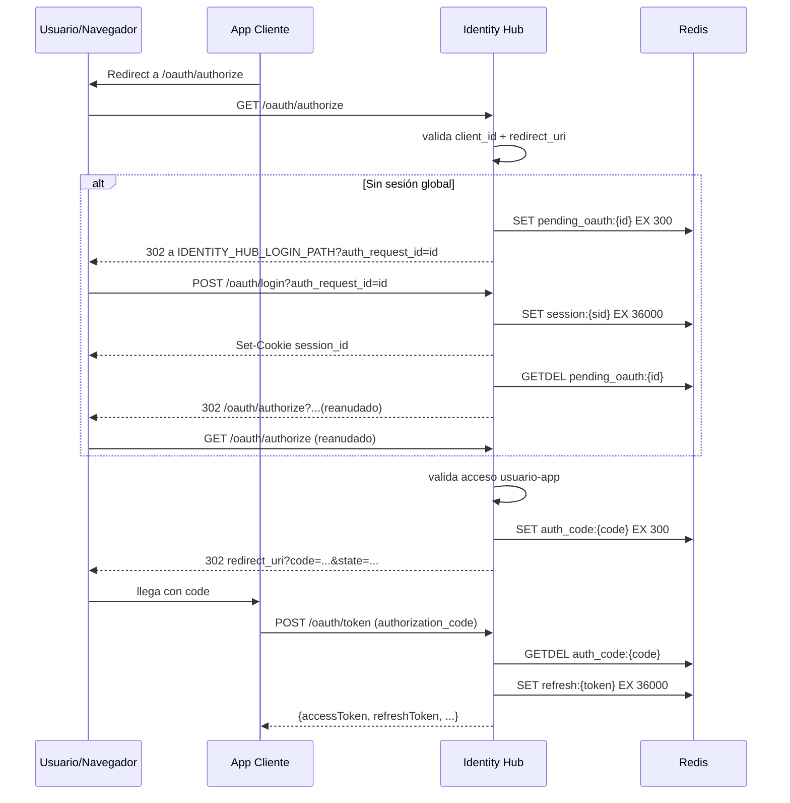

# Identity Hub SSO Flow

## Objetivo del Identity Hub
Identity Hub centraliza autenticación y autorización SSO para múltiples aplicaciones cliente usando OAuth2 (`authorization_code` + `refresh_token`), sesión global con cookie HTTP-only y emisión de JWT firmados con RS256.

## Componentes involucrados
- **Identity Hub (NestJS)**: expone `/oauth/authorize`, `/oauth/token`, `/.well-known/jwks.json`, login/logout y validaciones de acceso.
- **Aplicaciones cliente**: inician autorización OAuth y consumen tokens.
- **Navegador**: sigue redirects de `/oauth/authorize` y maneja cookie de sesión global.
- **Redis**: estado temporal y efímero (sesiones, `auth_request_id`, authorization codes, refresh tokens).
- **PostgreSQL**: datos persistentes (usuarios, apps cliente, `redirectUris`, `clientSecretHash`, relación usuario-app).
- **JWT RS256**: access tokens firmados con llave privada.
- **JWKS**: publicación de llave pública para validación de access tokens.

## Rutas involucradas
- `GET /oauth/authorize`
- `POST /oauth/login`
- `POST /oauth/token`
- `GET /.well-known/jwks.json`
- `POST /auth/logout`
- `GET /auth/status`

## Cookies involucradas
- `session_id`:
  - `httpOnly: true`
  - `sameSite: lax`
  - `secure: IDENTITY_COOKIE_SECURE`
  - `path: /`
  - TTL: 10 horas

## Variables de entorno importantes
- `IDENTITY_HUB_HOME_PATH`: destino post-login cuando no hay OAuth pendiente.
- `IDENTITY_HUB_LOGIN_PATH`: pantalla/ruta de login del Identity Hub.
- `AUTH_ERROR_REDIRECT` (opcional): destino para errores de authorize/login mostrados por Identity Hub.
- `IDENTITY_COOKIE_SECURE`: `true/false` para cookie de sesión.
- `JWT_ISSUER`: `iss` de los access tokens.
- `JWT_PRIVATE_KEY_PATH` / `JWT_PUBLIC_KEY_PATH`: llaves RSA.
- `REDIS_URL`: almacenamiento temporal OAuth/Sesión.

## Flujo 1: Usuario entra directamente al Identity Hub
1. Navegador entra a la UI del Identity Hub.
2. Usuario autentica credenciales contra `POST /oauth/login` (sin `auth_request_id`).
3. Identity Hub crea sesión global en Redis (`session:{uuid}`) y setea `session_id`.
4. Identity Hub redirige a `IDENTITY_HUB_HOME_PATH`.

## Flujo 2: Usuario entra desde app cliente
1. App cliente redirige al navegador a `GET /oauth/authorize?...`.
2. Identity Hub valida `client_id`, `redirect_uri`, `response_type`.
3. Si existe sesión global válida, continúa el authorize.
4. Si no existe sesión, pasa al flujo 3.

## Flujo 3: `/oauth/authorize` sin sesión global
1. Identity Hub persiste request OAuth temporal en Redis:
   - key: `pending_oauth:{auth_request_id}`
   - TTL: 5 minutos
2. Identity Hub redirige a `IDENTITY_HUB_LOGIN_PATH?auth_request_id=...`.

## Flujo 4: Reanudación de authorize tras login
1. Usuario completa login en `POST /oauth/login?auth_request_id=...`.
2. Identity Hub crea cookie `session_id`.
3. Identity Hub consume `pending_oauth:{auth_request_id}` con operación de un solo uso (`GETDEL`).
4. Si existe, redirige internamente a `/oauth/authorize` con parámetros originales.
5. Si no existe/expiró, redirige a `IDENTITY_HUB_HOME_PATH`.

## Flujo 5: Authorization code exitoso
1. En `/oauth/authorize`, Identity Hub valida acceso usuario-app activa.
2. Si tiene acceso, genera `authorization code` aleatorio.
3. Guarda en Redis:
   - key: `auth_code:{code}`
   - TTL: 5 minutos
   - uso único (se consume con `GETDEL` en `/oauth/token`)
4. Redirige a `redirect_uri?code=...&state=...`.

## Flujo 6: Intercambio `code -> tokens`
1. Cliente llama `POST /oauth/token` con `grant_type=authorization_code`.
2. Identity Hub valida:
   - app activa por `client_id`
   - `client_secret` vs `clientSecretHash` (bcrypt)
   - code vigente y no reutilizado
   - coincidencia exacta de `redirect_uri` y `client_id` contra el contexto del code
   - usuario activo y con acceso vigente
3. Emite:
   - `accessToken` (JWT RS256 con `kid`, `iss`, `aud`)
   - `refreshToken` rotativo de un solo uso

## Flujo 7: Refresh token
1. Cliente llama `POST /oauth/token` con `grant_type=refresh_token`.
2. Identity Hub consume `refresh:{token}` con `GETDEL` (no reutilizable).
3. Revalida app/usuario/acceso.
4. Emite nuevo par `accessToken` + `refreshToken`.

## Flujo 8: Logout del Identity Hub
1. Cliente/UI llama `POST /auth/logout`.
2. Identity Hub elimina sesión `session:{id}`.
3. Revoca todos los refresh tokens del usuario (`user_refresh_tokens:{userId}`).
4. Limpia cookie `session_id`.

## Manejo de errores

### Antes de validar `client_id`/`redirect_uri`
- **No se redirige al `redirect_uri` del cliente** (aún no confiable).
- Identity Hub redirige a `AUTH_ERROR_REDIRECT` (o `IDENTITY_HUB_LOGIN_PATH`) con `?error=...`.

### Después de validar `client_id`/`redirect_uri`
- En `/oauth/authorize`, errores de autorización de negocio (ej. usuario sin acceso) vuelven al cliente:
  - `redirect_uri?error=access_denied&state=...`

### Usuario sin acceso a app cliente
- Respuesta por redirect del navegador hacia `redirect_uri` validado con `error=access_denied`.

### Errores en `/oauth/token`
- Siempre JSON (sin redirects), porque es endpoint server-to-server.
- Ejemplos: `invalid_client`, `Invalid or expired code`, `Invalid or expired refresh token`.

### Errores de sesión/login
- Login inválido o usuario deshabilitado redirige a pantalla de login/error del Identity Hub con `?error=...`.
- Sesión ausente en endpoints protegidos: `401` JSON.

## Qué tipo de error va a cada canal
- **Vista Identity Hub**: errores previos a callback confiable (cliente/redirect inválidos, login UI).
- **Redirect a cliente (`?error=...`)**: errores post-validación de `client_id` + `redirect_uri`.
- **JSON API**: endpoints no browser-flow (`/oauth/token`, endpoints protegidos API).

## Almacenamiento temporal en Redis
- `session:{sessionId}` (10h)
- `pending_oauth:{auth_request_id}` (5 min, un solo uso)
- `auth_code:{code}` (5 min, un solo uso)
- `refresh:{refreshToken}` (10h, un solo uso)
- `user_refresh_tokens:{userId}` (índice para revocación global)

## Decisiones de seguridad relevantes
- `redirect_uri` se valida por coincidencia exacta contra `redirectUris` registradas.
- Nunca se redirige al cliente si `client_id`/`redirect_uri` no fueron validados.
- Authorization code y refresh token son de un solo uso (mitiga replay).
- `/oauth/authorize` usa redirects de navegador (flujo interactivo).
- `/oauth/token` usa JSON (flujo backend-to-backend).
- JWKS publica solo llave pública.
- El contrato de respuesta de tokens es **camelCase** (`accessToken`, `refreshToken`, etc.); no es error si clientes y Hub están alineados.

## Naming recomendado
- Mantener `IDENTITY_HUB_HOME_PATH` y `IDENTITY_HUB_LOGIN_PATH`.
- Mantener `JWT_ISSUER` (válido para OAuth mientras el `iss` sea estable y documentado).
- Usar `AUTH_ERROR_REDIRECT` solo para vista de error UI del Hub.
- Mantener términos de dominio: `authorization code`, `auth_request_id`, `refresh token`, `clientId`, `redirectUris`.

## Diagrama de secuencia principal

