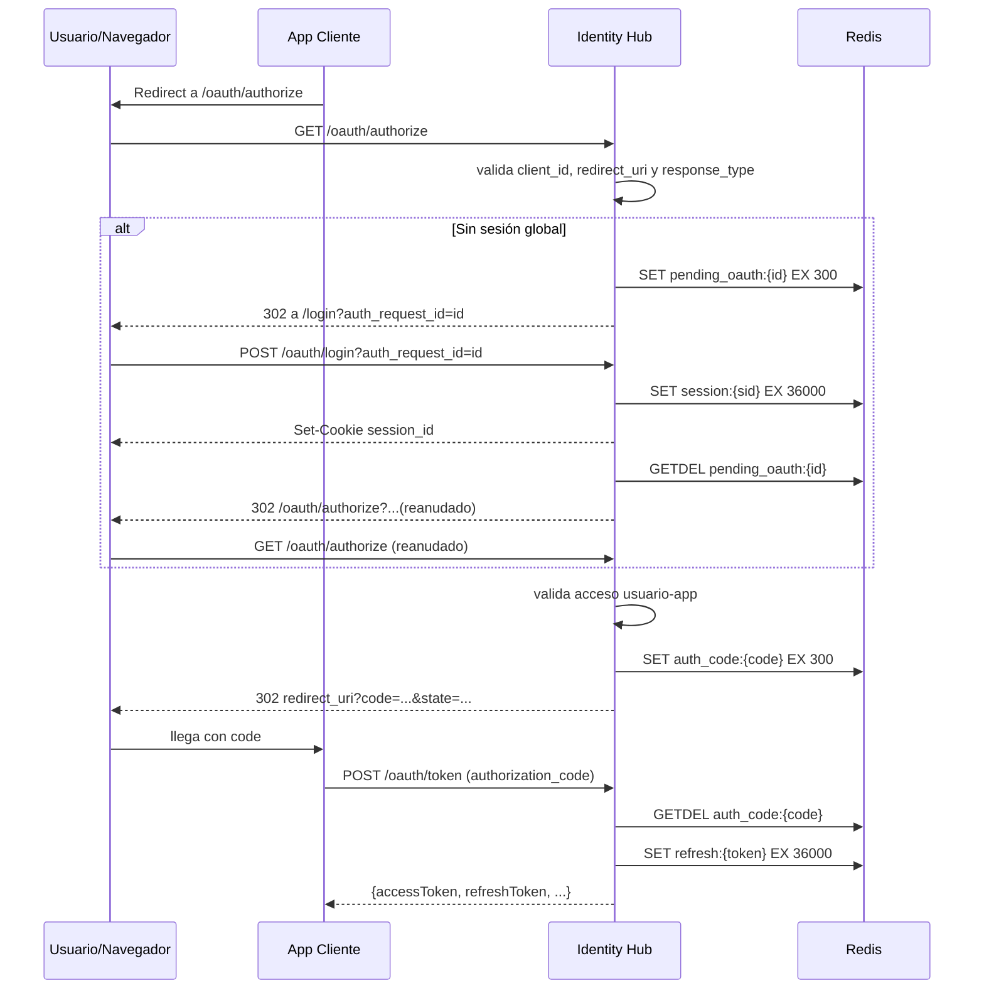

# Identity Hub SSO Flow

## Overview
Identity Hub actúa como proveedor central de autenticación y autorización para múltiples aplicaciones cliente.

El diseño actual combina:
- OAuth2 con `authorization_code` y `refresh_token`
- sesión global del navegador con cookie HTTP-only
- access tokens JWT firmados con RS256
- JWKS público para validación externa
- Redis para estado efímero del flujo

Este documento explica el recorrido completo del usuario, qué hace cada endpoint y cuál es el siguiente paso esperado en cada etapa.

## Componentes y responsabilidades
| Componente | Responsabilidad principal |
| --- | --- |
| Identity Hub API | Validar clientes OAuth, autenticar usuarios, emitir codes/tokens, publicar JWKS y administrar sesión global |
| Identity Hub UI | Mostrar login, home y error propios del Hub |
| Aplicación cliente | Iniciar `authorize`, intercambiar code por tokens y consumir access tokens |
| Navegador | Seguir redirects de `/oauth/authorize` y transportar la cookie `session_id` |
| Redis | Guardar sesión, `auth_request_id`, authorization codes y refresh tokens |
| PostgreSQL | Persistir usuarios, apps cliente, `redirectUris` y asignación usuario-app |

## Rutas relevantes
### Backend
| Ruta | Método | Tipo | Propósito | Siguiente paso típico |
| --- | --- | --- | --- | --- |
| `/oauth/authorize` | `GET` | Navegador | Iniciar o continuar autorización OAuth | Redirect a login, error UI o callback cliente |
| `/oauth/login` | `POST` | Navegador/UI | Autenticar usuario y crear sesión global | Redirect a `/home/welcome` o reanudación de `authorize` |
| `/oauth/token` | `POST` | Backend-to-backend | Intercambiar code o refresh token por nuevos tokens | Respuesta JSON |
| `/.well-known/jwks.json` | `GET` | Público | Exponer llave pública para validar JWT | Consumo por clientes/servicios |
| `/auth/logout` | `POST` | UI/API | Cerrar sesión global y revocar refresh tokens del usuario | Sesión invalidada |
| `/auth/status` | `GET` | API protegida | Devolver usuario autenticado actual | Uso por UI |
| `/auth/change-password` | `PATCH` | API protegida | Permitir cambio de contraseña | Usuario actualizado |

### UI derivada
Estas rutas no se configuran por variable individual. Se resuelven internamente a partir de `IDENTITY_HUB_UI_BASE_URL`.

| Ruta UI | Uso |
| --- | --- |
| `/login` | Pantalla de autenticación y errores de login |
| `/home/welcome` | Destino por defecto después de login directo |
| `/auth/error` | Vista propia del Hub para errores tempranos de `/oauth/authorize` |

## Infraestructura HTTP
| Tema | Comportamiento actual |
| --- | --- |
| `setGlobalPrefix('api')` | Aplica a la API general |
| Exclusiones del prefijo | `/oauth/*` y `/.well-known/*` quedan públicos y estables |
| `ServeStaticModule` | Sirve Angular en producción desde `public/` |
| Exclusiones de `ServeStaticModule` | `/api/*`, `/oauth/*` y `/.well-known/*` |

## Cookie de sesión global
| Propiedad | Valor |
| --- | --- |
| Nombre | `session_id` |
| `httpOnly` | `true` |
| `sameSite` | `lax` |
| `secure` | `IDENTITY_COOKIE_SECURE` |
| `path` | `/` |
| TTL | 10 horas |

## Estado efímero en Redis
| Clave | Contenido | TTL | Uso |
| --- | --- | --- | --- |
| `session:{sessionId}` | Sesión global del navegador | 10h | Identificar usuario autenticado |
| `pending_oauth:{authRequestId}` | Request OAuth pendiente | 5 min | Reanudar `authorize` después del login |
| `auth_code:{code}` | Authorization code | 5 min | Intercambio único por tokens |
| `refresh:{refreshToken}` | Refresh token rotativo | 10h | Obtener un nuevo par de tokens |
| `user_refresh_tokens:{userId}` | Índice de refresh tokens del usuario | 10h aprox. | Revocación masiva en logout o bloqueo |

## Flujo completo
### Resumen textual
1. La app cliente o la UI del Hub inicia el flujo.
2. Si el usuario no tiene sesión global, el backend redirige a login.
3. Tras login exitoso, el backend crea `session_id` y reanuda el `authorize` pendiente si existe.
4. Si la app, el `redirect_uri` y el acceso del usuario son válidos, se emite un authorization code.
5. La app cliente intercambia el code por tokens en `/oauth/token`.
6. Más adelante puede usar `refresh_token` para rotar el par de tokens.
7. El logout borra la sesión global y revoca refresh tokens del usuario.

### Flujo 1: login directo al Identity Hub
| Paso | Actor | Acción | Resultado |
| --- | --- | --- | --- |
| 1 | Navegador | Entra a la UI del Hub | Ve `/login` o una ruta interna de UI |
| 2 | UI | Llama `POST /oauth/login` sin `auth_request_id` | El backend valida credenciales |
| 3 | Backend | Crea `session:{uuid}` y `Set-Cookie: session_id=...` | Se establece sesión global |
| 4 | Backend | Redirige a `IDENTITY_HUB_UI_BASE_URL/home/welcome` | El usuario queda autenticado dentro del Hub |

### Flujo 2: login iniciado desde una app cliente
| Paso | Actor | Acción | Resultado |
| --- | --- | --- | --- |
| 1 | App cliente | Redirige a `GET /oauth/authorize` | El navegador llega al Hub |
| 2 | Backend | Valida `client_id`, `redirect_uri` y `response_type=code` | Determina si puede continuar |
| 3 | Backend | Si no hay sesión global, guarda `pending_oauth:{authRequestId}` | El contexto queda listo para reanudación |
| 4 | Backend | Redirige a `/login?auth_request_id=...` | La UI muestra el login del Hub |

### Flujo 3: reanudación después del login
| Paso | Actor | Acción | Resultado |
| --- | --- | --- | --- |
| 1 | UI | Llama `POST /oauth/login?auth_request_id=...` | El backend autentica al usuario |
| 2 | Backend | Crea cookie `session_id` | Se establece sesión global |
| 3 | Backend | Consume `pending_oauth:{authRequestId}` con `GETDEL` | El request pendiente queda invalidado para reuso |
| 4 | Backend | Redirige internamente a `/oauth/authorize` con los parámetros originales | El flujo OAuth continúa |
| 5 | Backend | Si el request expiró o ya fue consumido, redirige a `/home/welcome` | El usuario no queda bloqueado |

### Flujo 4: authorize con sesión global
| Paso | Validación | Si falla | Si pasa |
| --- | --- | --- | --- |
| 1 | Existe `session_id` válido | Login UI | Continúa |
| 2 | `client_id` corresponde a app activa | Error UI del Hub | Continúa |
| 3 | `redirect_uri` coincide exactamente con una registrada | Error UI del Hub | Continúa |
| 4 | Usuario sigue activo y tiene acceso a la app | Redirect al cliente con `access_denied` | Continúa |
| 5 | Crear `auth_code:{code}` de un solo uso | N/A | Redirect al cliente con `code` y `state` |

### Flujo 5: code exchange
`POST /oauth/token` con `grant_type=authorization_code`.

| Validación | Descripción |
| --- | --- |
| Cliente | `client_id` existe y la app está activa |
| Secreto | `client_secret` se exige sólo para clientes confidenciales |
| Code | Existe, no expiró y no fue reutilizado |
| Contexto | `client_id` y `redirect_uri` coinciden con lo guardado en el code |
| Usuario | Sigue activo |
| Acceso | El usuario todavía tiene acceso a la app |

Si todo es válido:
- se firma un `accessToken` RS256
- se genera un `refreshToken` rotativo
- la respuesta es JSON

### Flujo 6: refresh token
`POST /oauth/token` con `grant_type=refresh_token`.

| Paso | Acción |
| --- | --- |
| 1 | Consumir `refresh:{token}` con `GETDEL` |
| 2 | Revalidar app activa, secreto si aplica, usuario y acceso |
| 3 | Emitir un nuevo `accessToken` y un nuevo `refreshToken` |

### Flujo 7: logout
| Paso | Acción |
| --- | --- |
| 1 | `POST /auth/logout` |
| 2 | Eliminar `session:{sessionId}` si existe |
| 3 | Revocar refresh tokens del usuario vía `user_refresh_tokens:{userId}` |
| 4 | Limpiar la cookie `session_id` |

## Contratos que conviene preservar
| Tema | Decisión actual |
| --- | --- |
| `authorize` | Usa redirects de navegador |
| `token` | Responde JSON, no redirects |
| UI base | Se construye con `IDENTITY_HUB_UI_BASE_URL` |
| Rutas UI | Son constantes internas |
| Errores tempranos de `authorize` | Se quedan en la UI del Hub |
| Errores posteriores a `redirect_uri` validada | Pueden volver al cliente |
| Errores de login | Se muestran en `/login` |
| Tokens | Respuesta actual en `camelCase` |

## RS256 y JWKS
| Elemento | Uso |
| --- | --- |
| `JWT_PRIVATE_KEY_PATH` | Llave privada para firmar access tokens |
| `JWT_PUBLIC_KEY_PATH` | Llave pública publicada vía JWKS |
| `JWT_ISSUER` | Valor de `iss` en los access tokens |
| `aud` | `clientId` del cliente OAuth |
| `kid` actual | `main-key` |

## Diagrama de secuencia
El diagrama resume el camino más común cuando una app cliente inicia el flujo y el usuario todavía no tiene sesión global.

Si el visor no renderiza Mermaid, la lectura equivalente es:
1. La app redirige a `/oauth/authorize`.
2. El Hub detecta que falta sesión y redirige a `/login`.
3. El usuario hace login.
4. El Hub reanuda el `authorize`.
5. El Hub emite un code y redirige al cliente.
6. El cliente intercambia el code por tokens en `/oauth/token`.

