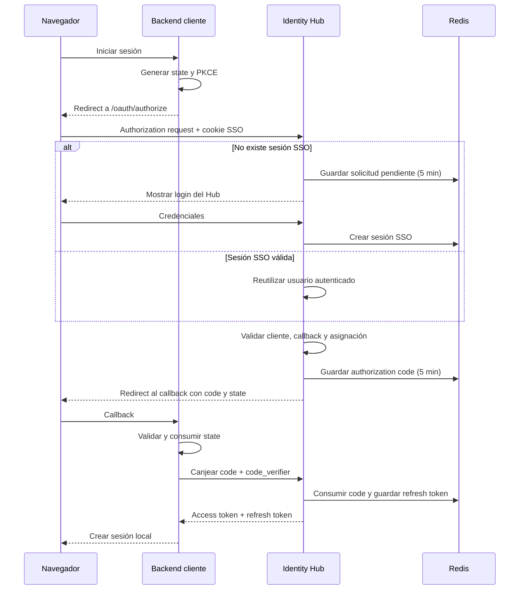

# Flujo SSO y OAuth

Identity Hub usa OAuth 2.0 Authorization Code con PKCE S256. El navegador transporta la cookie del Hub, pero el backend cliente controla el intento OAuth, recibe el callback y crea su propia sesión.

## Dos sesiones distintas

La sesión de Identity Hub vive en Redis y se referencia mediante la cookie `session_id`:

| Propiedad  | Valor                       |
| ---------- | --------------------------- |
| Duración   | 10 horas                    |
| `HttpOnly` | Siempre `true`              |
| `Secure`   | `IDENTITY_COOKIE_SECURE`    |
| `SameSite` | `IDENTITY_COOKIE_SAME_SITE` |
| `Path`     | `/`                         |

Esta cookie solo autentica al navegador frente a Identity Hub. Después del callback, el backend cliente debe crear y proteger una sesión local. Cerrar una de estas sesiones no elimina automáticamente la otra.

## Flujo principal


```mermaid
sequenceDiagram
    participant B as Navegador
    participant C as Backend cliente
    participant H as Identity Hub
    participant R as Redis

    B->>C: Iniciar sesión
    C->>C: Generar state y PKCE
    C-->>B: Redirect a /oauth/authorize
    B->>H: Authorization request + cookie SSO
    alt No existe sesión SSO
        H->>R: Guardar solicitud pendiente (5 min)
        H-->>B: Mostrar login del Hub
        B->>H: Credenciales
        H->>R: Crear sesión SSO
    else Sesión SSO válida
        H->>H: Reutilizar usuario autenticado
    end
    H->>H: Validar cliente, callback y asignación
    H->>R: Guardar authorization code (5 min)
    H-->>B: Redirect al callback con code y state
    B->>C: Callback
    C->>C: Validar y consumir state
    C->>H: Canjear code + code_verifier
    H->>R: Consumir code y guardar refresh token
    H-->>C: Access token + refresh token
    C-->>B: Crear sesión local
```

### 1. Authorization request

El backend cliente redirige el navegador a `GET /oauth/authorize` con:

| Parámetro               | Regla                                                |
| ----------------------- | ---------------------------------------------------- |
| `response_type`         | Debe ser `code`.                                     |
| `client_id`             | Debe identificar una aplicación activa.              |
| `redirect_uri`          | Debe coincidir exactamente con una URI registrada.   |
| `state`                 | Obligatorio; Identity Hub lo devuelve sin modificar. |
| `code_challenge`        | PKCE, entre 43 y 128 caracteres permitidos.          |
| `code_challenge_method` | Debe ser `S256`.                                     |

`scope` no está soportado y se rechaza. Identity Hub valida la aplicación y el callback antes de cualquier redirección externa. Si alguno es inválido, muestra su propia pantalla de error y no utiliza la URI recibida.

### 2. Login o reutilización SSO

Sin una sesión válida, Identity Hub guarda la solicitud validada en Redis durante cinco minutos y dirige al usuario a su UI de login. Tras autenticarlo, vincula la solicitud a la nueva sesión y la consume una sola vez al reanudar el authorize.

Con una sesión SSO válida no vuelve a pedir credenciales. Revalida al usuario, la aplicación y su asignación, y continúa directamente. Así se obtiene SSO entre varios clientes sin compartir cookies ni sesiones locales entre ellos.

Si el usuario debe cambiar su contraseña, conserva una sesión central restringida y la solicitud pendiente. La UI del Hub completa el cambio autenticado y usa el `redirectUrl` devuelto para reanudar el authorize. Si la solicitud vence, vuelve al home del Hub y el cliente debe iniciar un flujo nuevo.

### 3. Callback

Cuando el usuario es elegible, Identity Hub crea un authorization code de un solo uso, válido por cinco minutos, y redirige al callback registrado:

```text
https://client.example/auth/callback?code=<code>&state=<state>
```

Si el usuario no es elegible o ya no existe su asignación, el callback validado recibe `error=access_denied` junto con `state`. Una aplicación inactiva se trata como cliente inválido antes de usar el callback.

El backend cliente compara `state` con el valor guardado y lo consume antes de canjear el code. Identity Hub no sustituye esta validación: `state` pertenece al contrato de seguridad entre el navegador y el cliente.

### 4. Canje y refresh

`POST /oauth/token` acepta solo `application/x-www-form-urlencoded` y los grants `authorization_code` y `refresh_token`.

Un cliente confidencial se autentica con HTTP Basic. Un cliente público omite Basic e incluye `client_id` en el formulario. El secreto nunca se acepta en el body.

Para canjear el code se revalidan:

- cliente activo y autenticación del cliente;
- code no vencido ni consumido;
- mismo `client_id` y `redirect_uri`;
- `code_verifier` contra el challenge S256;
- usuario activo, contraseña habilitada y asignación vigente.

El access token dura 10 minutos. El refresh token dura 10 horas, se guarda en Redis y rota en cada uso. El code y los refresh tokens se consumen de forma atómica; ante dos usos concurrentes solo uno puede tener éxito.

Un cambio o reset de contraseña, y la transición de usuario activo a inactivo, incrementan la versión interna de la credencial. Los refresh tokens anteriores dejan de ser utilizables aunque falle su eliminación física en Redis y no recuperan validez si el usuario se reactiva. Esta versión se compara únicamente durante el refresh: no forma parte del access token ni de la sesión SSO. Los access tokens ya emitidos no tienen blacklist y siguen siendo válidos hasta `exp`.

## Tokens e identidad

El access token es un JWT RS256 con `kid=main-key`. Contiene:

| Claim         | Uso                                                    |
| ------------- | ------------------------------------------------------ |
| `iss`         | Valor exacto de `IDENTITY_HUB_PUBLIC_URL`.             |
| `aud`         | `clientId` del cliente receptor.                       |
| `sub`         | UUID interno del usuario en esta instancia.            |
| `externalKey` | Identificador estable para integrar el usuario.        |
| `name`        | Nombre visible; puede cambiar.                         |
| `clientId`    | Campo redundante; no sustituye la validación de `aud`. |
| `iat`, `exp`  | Emisión y expiración.                                  |

No contiene roles, correo, `scope`, `mustChangePassword` ni versión de credencial. La clave pública se publica en `GET /.well-known/jwks.json`.

## Contraseñas y sesión

- La configuración inicial y los resets administrativos crean acciones con expiración y de un solo uso en PostgreSQL. Solo se persiste el hash del código.
- Reenviar una acción pendiente conserva su propósito, renueva su expiración e invalida el código anterior.
- La recuperación pública responde de forma neutra y solo envía correo a usuarios activos con correo registrado.
- Completar una acción establece la contraseña, elimina acciones pendientes y revoca refresh tokens, pero no crea sesión ni reanuda OAuth.
- El cambio autenticado elimina acciones pendientes, conserva la sesión central y puede reanudar una autorización pendiente.

## Logout

`POST /api/auth/logout` elimina la sesión central y revoca todos los refresh tokens indexados para el usuario, incluidos los emitidos para otros clientes. La cookie se limpia con los mismos atributos usados al crearla.

No existe logout federado ni endpoint de cierre con callback. Identity Hub no borra sesiones, cookies o tokens almacenados por los clientes. Cada cliente debe cerrar su propia sesión y descartar sus credenciales locales. Los access tokens emitidos antes del logout siguen siendo válidos hasta su expiración.
