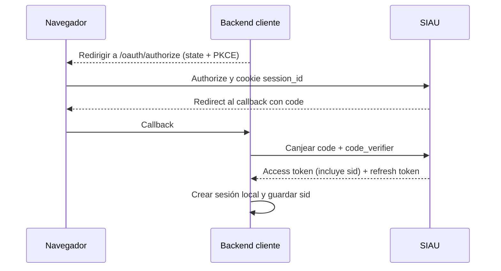

# SSO y Single Logout

SIAU mantiene una sesión central en Redis por cada inicio de sesión. Esa sesión contiene el usuario, la versión de sus credenciales, un `sid` y las aplicaciones que participaron mediante OAuth. Expira de forma absoluta a las 10 horas: su vigencia no se extiende con el uso.

`sessionId` y `sid` tienen propósitos distintos:

- `sessionId` es la credencial privada y aleatoria que SIAU guarda en la cookie HTTP-only `session_id`. No se entrega a las aplicaciones.
- `sid` es un identificador de correlación compartido en los tokens. Permite relacionar la sesión central con las sesiones locales, pero no autentica por sí solo.

## Flujo SSO


```mermaid
sequenceDiagram
    participant U as Navegador
    participant C as Backend cliente
    participant S as SIAU

    C-->>U: Redirigir a /oauth/authorize (state + PKCE)
    U->>S: Authorize y cookie session_id
    S-->>U: Redirect al callback con code
    U->>C: Callback
    C->>S: Canjear code + code_verifier
    S-->>C: Access token (incluye sid) + refresh token
    C->>C: Crear sesión local y guardar sid
```

El access token dura 10 minutos. El refresh token rota en cada uso y nunca puede superar la expiración absoluta de la sesión SIAU. El backend cliente crea y controla su propia sesión local después de validar el callback y los tokens.

## Single Logout

El backend cliente inicia el cierre con `POST /internal/sessions/logout`, autenticándose con su `clientId` y client secret mediante HTTP Basic, y envía:

```json
{ "sid": "<uuid>" }
```

SIAU exige que la aplicación esté activa, que el `sid` corresponda a una sesión vigente y que esa aplicación figure entre sus participantes. Entonces elimina únicamente esa sesión central y envía un `POST` a cada `backchannelLogoutUri` participante, incluido el cliente iniciador:

```text
Content-Type: application/x-www-form-urlencoded

logout_token=<JWT>
```

Los fallos de un receptor se registran, pero no revierten el cierre central. SIAU no dirige el navegador ni elimina su cookie desde esta petición backend-to-backend; una cookie antigua simplemente referencia una sesión inválida.

## Integración de clientes

Cada cliente debe:

- guardar el `sid` del access token dentro de su sesión local;
- iniciar el logout autenticando su backend ante SIAU;
- registrar y exponer un `backchannelLogoutUri` idempotente;
- validar firma, algoritmo, issuer, audience y expiración del Logout Token;
- eliminar todas sus sesiones locales asociadas al `sid` recibido.

SIAU firma access tokens y Logout Tokens con RS256 y publica las claves en `GET /.well-known/jwks.json`. El Logout Token usa el header `typ: logout+jwt`, dura 2 minutos y contiene `iss`, `aud` igual al `clientId` receptor, `iat`, `exp`, `jti`, `sid` y:

```json
{
  "events": {
    "http://schemas.openid.net/event/backchannel-logout": {}
  }
}
```

No contiene `nonce`. La clave de `events` es el identificador estándar del evento; no es una URL que el cliente deba consultar.
